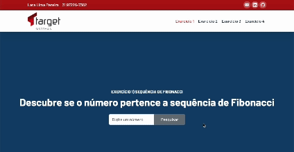

# Exercícios Target System

## 💻 Sobre a aplicação

Ela é dividida em 4 partes, sendo cada uma delas responsável pelo desenvolvimento das alternativas: Afirmar se um número pertence a sequência Fibonnaci; Trazer o menor e o maior faturamento de uma empresa no prazo de 30 dias, além da quantidade de dias que ficaram acima da média; Trazer a porcentagem de faturamento de Estados de acordo com o objeto solicitado; Inverter a ordem dos caracteres de uma palavra.

## 🛠 Tecnologias

As seguintes ferramentas foram usadas na construção do projeto:

- JavaScript
- Bootstrap
- CSS
- HTML

## 🚀 Instalação e execução

1. Faça um clone desse repositório;
2. Instale a extensão "Live Server"
3. Entre no arquivo index.html
4. Abra seu projeto no VS Code,
5. localize o arquivo "index.html"
6. Clique com o botão direito do mouse no arquivo HTML no explorador de arquivos do VS Code e selecione "Open with Live Server" no menu de contexto.
7. Isso abrirá automaticamente seu arquivo HTML em um servidor local.

## 🤔 Como contribuir para o projeto

1. Faça um _fork_ do projeto.
2. Crie uma nova branch com as suas alterações: `git checkout -b my-feature`
3. Salve as alterações e crie uma mensagem de commit contando o que você fez: `git commit -m "feature: My new feature"`
4. Envie as suas alterações: `git push origin my-feature`
   > Caso tenha alguma dúvida confira este [guia de como contribuir no GitHub](https://github.com/firstcontributions/first-contributions)

---

Feito com ❤️ por Lara Lima 👋🏽 [Entre em contato!](https://www.linkedin.com/in/lara-lima-pereira-b41585205/)
